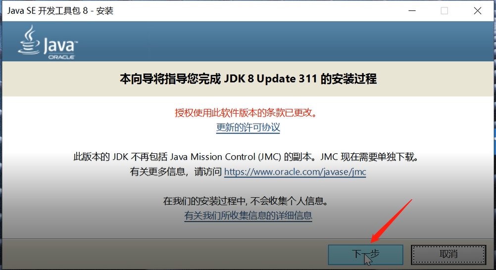
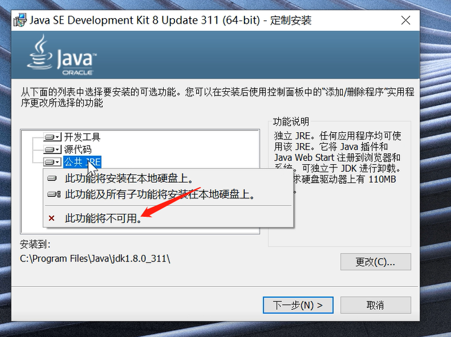
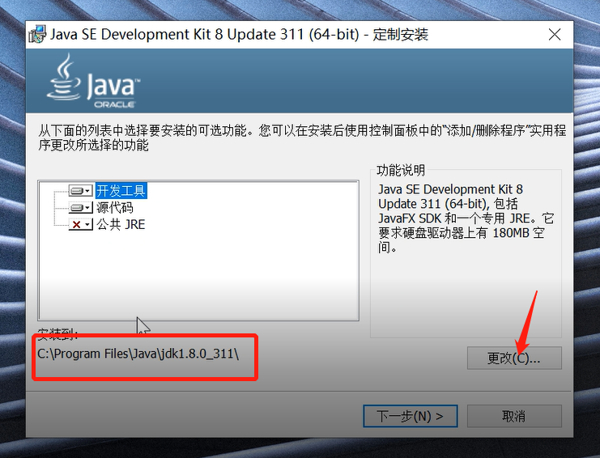
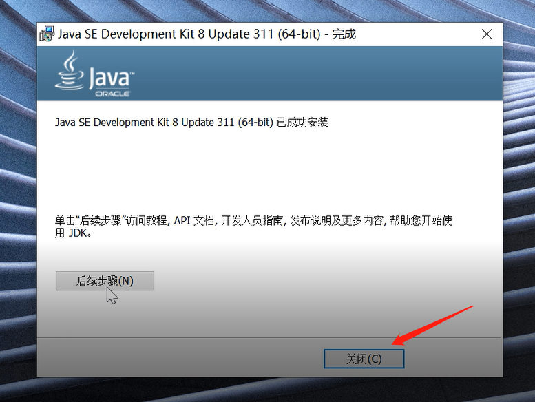
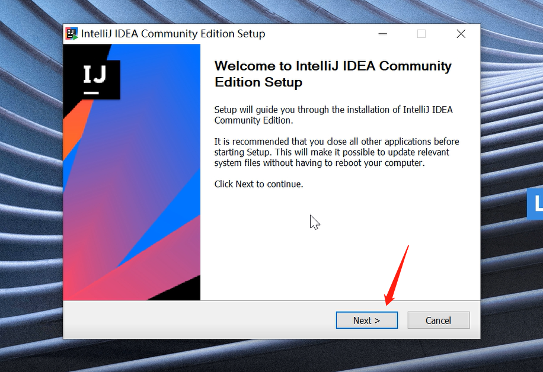
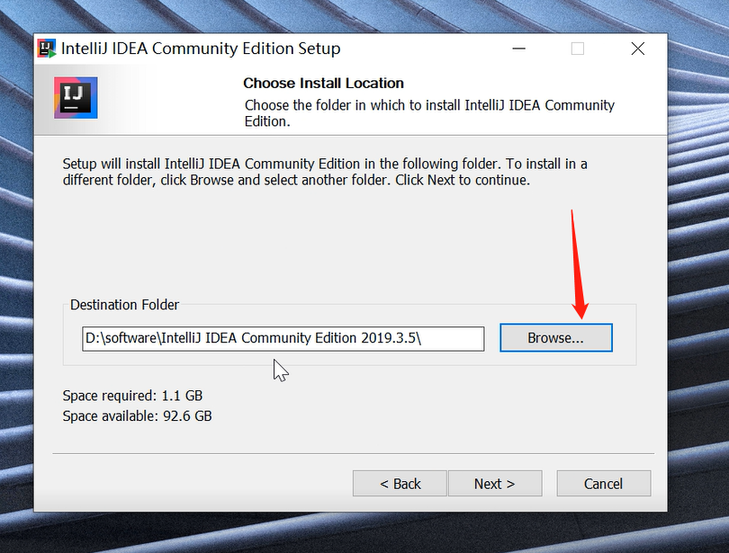
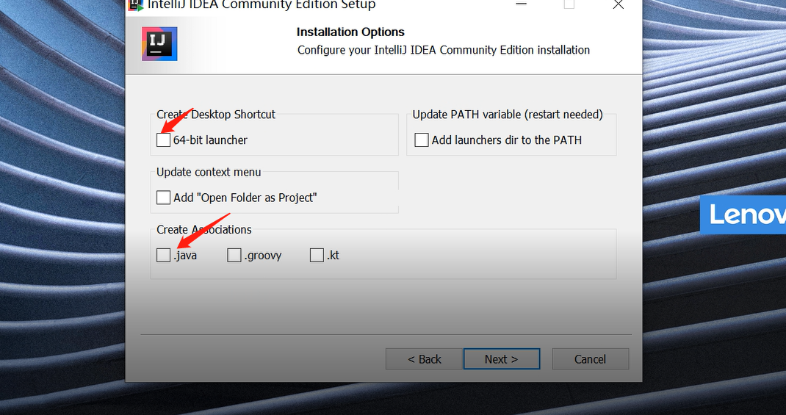
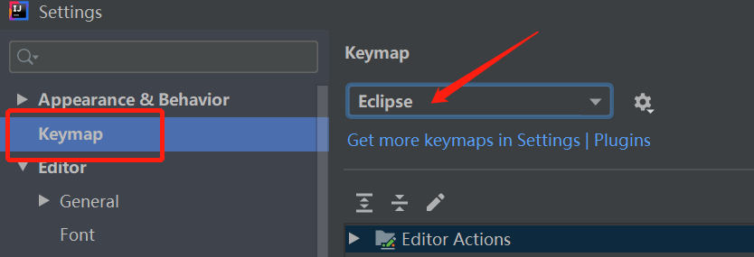
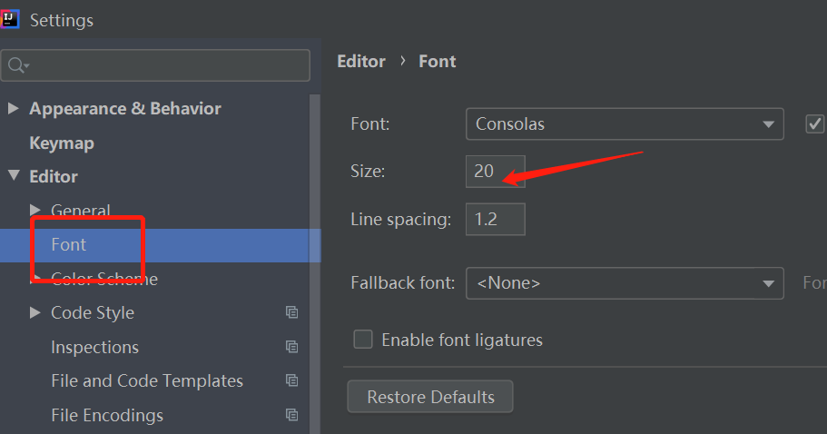

### 1、安装jdk

下载安装包：

官网： https://www.oracle.com/java/technologies/downloads/#java8-windows


下载x64的，然后一直安装即可。

百度云：https://pan.baidu.com/s/1Jui2uJ7d3eu0zGiDfOnbxA    密码： bs59


- 双击安装包



- 点击下一步，跳出下面界面，因为开发工具已经包含了JRE了，所以这里的公共的jre可以不要。点击公共的JRE，然后点击此功能不可用即可。

  

- 然后点击开发工具，修改安装的路径

  

- 修改完之后，点击下一步就可以安装了，安装完后，点击关闭就行了。

  


### 2、java语言概述

#### 2.1、人机交互方式

- 命令行（CLI  comand language interface）:  比较灵活，需要相关控制台，需要记住一些指令，较麻烦。

  基本的doc命令：

  ```yaml
  window:
    dir:  列出对应目录的所有文件
    cd: 进入某个目录
    cls: 清理控制台窗口
    
  linux：
    ls: 列出对应目录的所有文件
    cd: 进入某个目录
    clear: 清理控制台窗口
  ```

  

- 图形界面（GUI）：直观，简单容易操作


#### 2.2、2021年12月份语言的排行


#### 2.3、java的两大核心机制

- java虚拟机（JVM）

  - java程序的运行要借助jvm
  - 不同的平台都有对应的jvm，jvm屏蔽不同平台的实现细节，让java程序可以一次编译，到处运行。

- 垃圾回收（GC）: 

  将不再使用的内存回收，就是垃圾回收。

  java会主动回收这些不再使用的内存，不需要程序员负责回收，程序员也无法精确干预。


#### 2.4、java语言的特点

- 面向对象
  - 类和对象（类相当于模板，对象就是实际的模板数据）
  - 继承（java单继承），多态（多种状态，一个接口或者父类，具有不同的实现，当我们的接口或者父类调用时，会根据不同的实现不同的行为），封装（合法性的校验）
- 平台无关性
  - 不同平台都有对应的jvm，所以java程序可以一次编译，到处运行


#### 2.5、jdk和jre的区别

- jdk是java的开发工具，它包括jre，还有一些编译器（javac），jmap等分析内存和线程的工具，面向的是java的开发人员。
- jre是java的运行环境，主要是对已经编译好的程序进行相关的运行。

​    xxx.java  ->  javac -> xxx.class  ->  java  运行程序


#### 2.6、java的API

​	运用程序接口就是java提供的系统类库。比如tools.jar、dt.jar等包里面的类等。

- 这里有系统类库，本地类库和第三方类库
  - 系统类库： java自身提供的类库
  - 本地类库：项目中，自己写的
  - 第三方类库： 引入别人的jar包才导入的类，比如你要使用spring的功能，你引入的spring的jar包就是第三方提供的类库。

#### 2.7、注释

- 单行注释 //
- 多行注释  /**   多行内容  **/


#### 2.8、helloworld的编写

- 创建一个Hello.txt的文件
- 然后加入以下内容

```java
public class Hello{

   public static void main(String[] args){
     System.out.println("helloworld!");
  }
}
```

- 修改.txt为java
- javac Hello.java
- java Hello


### 3、安装Idea开发工具

idea的下载地址：

官网：https://download.jetbrains.com/idea/ideaIC-2019.3.5.exe?_gl=1*1bphgw1*_ga*MTk0MDk0Nzc2LjE2NDI1MDY2MDc.*_ga_V0XZL7QHEB*MTY0MjUwNjYwNi4xLjEuMTY0MjUwODIwOS4w&_ga=2.200549806.1225830675.1642506607-194094776.1642506607

百度云：https://pan.baidu.com/s/1JGW5SQ7EnoyeR5p5TV-sjA    密码：jtza

- 双击安装包
- 

- 点击下面的browse,选择安装的目录

  


- 勾选下面两个就好了。然后点击next就会安装了。

  


- 将快捷键切换成eclipse：File => setting => keymap => 选择Eclipse

  


- 修改.java文件的字体大小：File => setting => Font =>  修改size的值

  


### 4、基本语法

#### 4.1、关键字

*Java关键字*是预先定义的具有特别意义的标识符，*Java关键字*不能用作变量名、方法名、类名、包名和参数

| 访问控制             | private  | default    | protected | public       |            |           |        |
| -------------------- | -------- | ---------- | --------- | ------------ | ---------- | --------- | ------ |
| 类，方法和变量修饰符 | abstract | class      | extends   | final        | implements | interface | native |
|                      | new      | static     | strictfp  | synchronized | transient  | volatile  |        |
| 程序控制             | break    | continue   | return    | do           | while      | if        | else   |
|                      | for      | instanceof | switch    | case         | default    |           |        |
| 错误处理             | try      | catch      | throw     | throws       | finally    |           |        |
| 包相关               | import   | package    |           |              |            |           |        |
| 基本类型             | boolean  | byte       | char      | double       | float      | int       | long   |
|                      | short    | null       | true      | false        |            |           |        |
| 变量引用             | super    | this       | void      |              |            |           |        |
| 保留字               | goto     | const      |           |              |            |           |        |


一般的访问权限都会有下面这个表   （属性，方法，类）

| 访问权限  | 当前类 | 同一个包（子类同包） | 子类不同包 | 其他包 |
| --------- | ------ | -------------------- | ---------- | ------ |
| public    | ∨      | ∨                    | ∨          | ∨      |
| protected | ∨      | ∨                    | ∨          | ×      |
| default   | ∨      | ∨                    | ×          | ×      |
| private   | ∨      | ×                    | ×          | ×      |


#### 4.2、标识符

1、标识符：在java语言中，标识符常用来给类、对象、变量、方法、接口、自定义数据类型等命名的。

2、标识符命名规则：标识符由任意顺序的大小写字母(a-z,A-Z),数字（0-9）下划线（_）和美元符号($)组成。并且标识符不能以数字开头，标识符是区别大小写的，没有长度限制，不能把java关键字作为标识符。

例如：以下标识符是合法的：name,  my_name,  _21,  $money,

以下标识符是不合法的：class,  2name, name#age,  a+b,

3、需遵循的规范：

(1)、包名：所有字母一律小写。如：com.abc.demo。

(2)、类名和接口名：每个单词的首字母大写，其余小写。如：StudentDemo,HelloWorld。

(3)、常量名：所有字母都大写，单词间以下划线(_)连接。如：DAY_OF_MONTH。

(4)、变量名和方法名：第一个单词首字母小写，从第二个单词开始每个单词首字母大写。即驼峰式命名法。如：chineseScore,getTotalMoney()。

(5)、在程序中，应尽量使用有意义的英文单词来定义标识符，即见名知义，这样便于阅读。如：password表示密码，name表示姓名等。