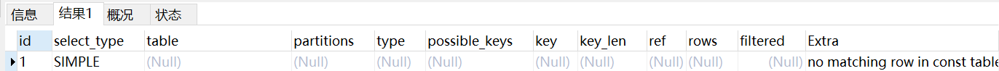

### 1、explain的介绍

explain可以查看mysql的select语句的执行计划。


查看有子查询的语句的时候，需要关闭一个合并衍生表的参数

```java
set session optimizer_switch='derived_merge=off'
```


创建两个测试表

```mysql
CREATE TABLE `mng_role` (
  `pk` int(11) NOT NULL AUTO_INCREMENT,
  `name` varchar(40) DEFAULT NULL COMMENT '角色名',
  `status` tinyint(4) DEFAULT '1' COMMENT '0无效,1有效 ',
  `created_at` timestamp NULL DEFAULT CURRENT_TIMESTAMP,
  `updated_at` timestamp NOT NULL DEFAULT CURRENT_TIMESTAMP ON UPDATE CURRENT_TIMESTAMP,
  PRIMARY KEY (`pk`) USING BTREE
) ENGINE=InnoDB AUTO_INCREMENT=63 DEFAULT CHARSET=utf8mb4 COMMENT='管理平台角色表';


CREATE TABLE `mng_permission` (
  `pk` int(11) NOT NULL AUTO_INCREMENT,
  `name` varchar(40) DEFAULT NULL COMMENT '权限名',
  `value` varchar(255) NOT NULL DEFAULT '' COMMENT '权限标识',
  `parent_pk` int(11) DEFAULT '0' COMMENT '父id',
  `status` tinyint(4) DEFAULT '1' COMMENT '0无效,1有效',
  `created_at` timestamp NULL DEFAULT CURRENT_TIMESTAMP,
  `updated_at` timestamp NULL DEFAULT CURRENT_TIMESTAMP ON UPDATE CURRENT_TIMESTAMP,
  PRIMARY KEY (`pk`) USING BTREE,
  KEY `index_pk` (`pk`) USING BTREE,
  KEY `index_parent_id` (`parent_pk`) USING BTREE
) ENGINE=InnoDB AUTO_INCREMENT=16 DEFAULT CHARSET=utf8mb4 ROW_FORMAT=DYNAMIC COMMENT='管理平台用户管理菜单';
```

- 分析1

  ```mysql
  explain select * from mng_role where pk = 1
  ```

  

    explian需要解析的字段有：

  - id  值越大，优先级也高，如果值一样，那么从上到下执行。

  - select_type   simple、derived、subQuery、union、primary

  - table  对应的sql查的表

  - type

    - all   全表查询
    - index 对索引进行全表查询，所需要的数据都在索引里
    - range  只检索一个范围的数据，使用索引来选择行
    - ref  普通索引查找的情况
    - eq_ref  主键或者uni_key关联的情况。
    - const  将主键放在where条件中时，命中的情况下，这个字段为const
    - system  const的特例，当查询的表只有一条记录且满足时就是system
    - null 表示不用访问表就可以知道结果，比如可以直接在索引中找到，或者索引没找到记录不回表的情况

  - possible_keys 可能用到的索引

  - key  实际用到的索引

  - key_len  用的索引的长度

  - ref  

  - rows  估计要扫描的行数

  - extra

    

  

- 